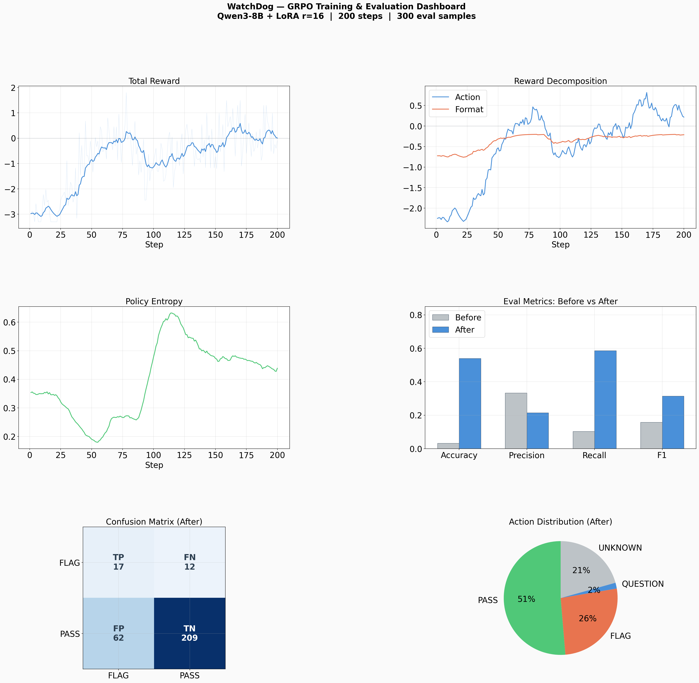
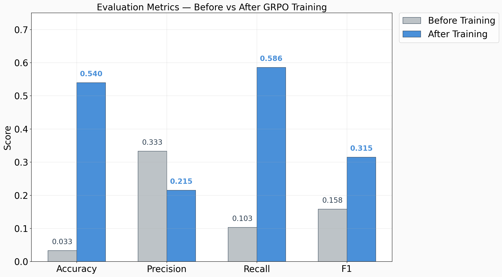
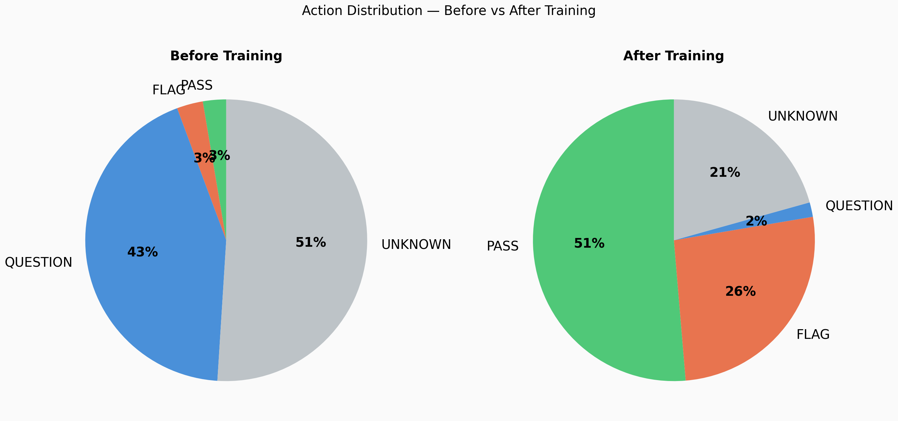
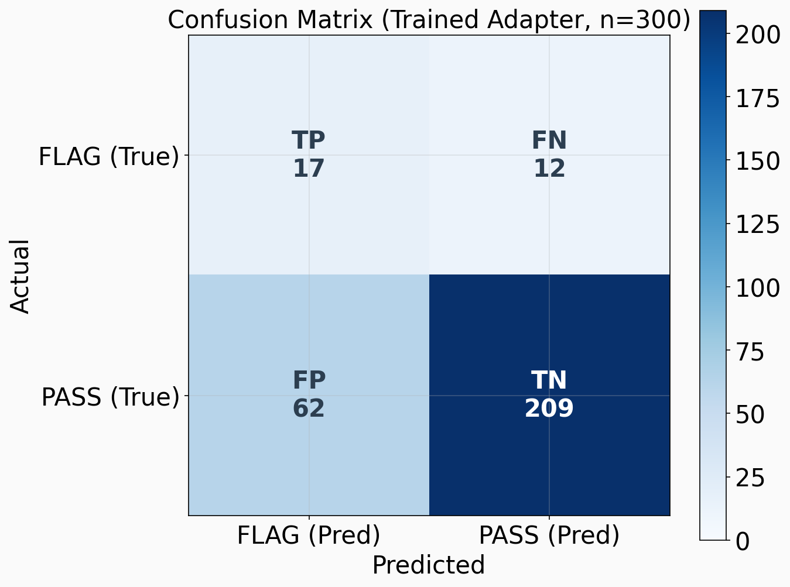
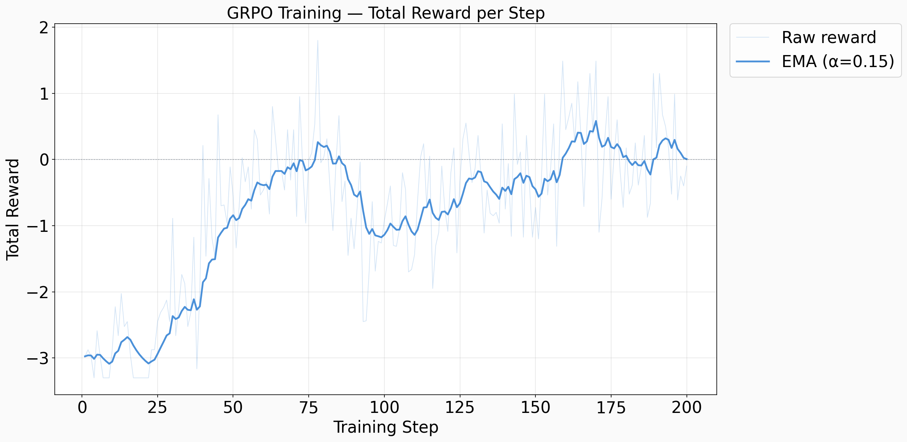
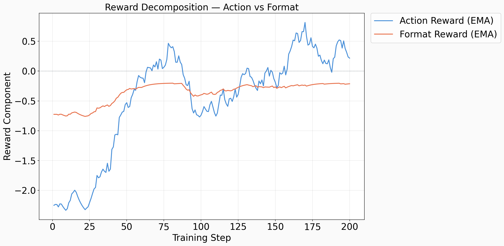
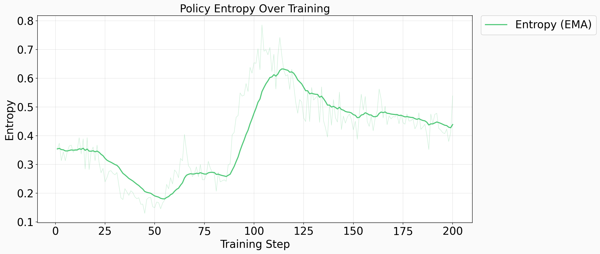
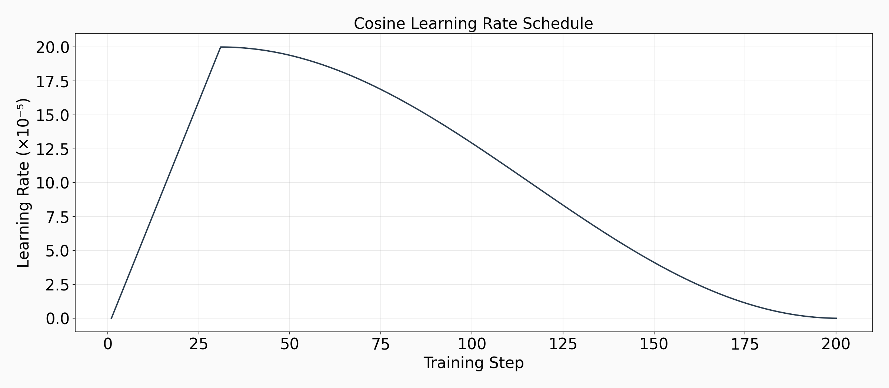
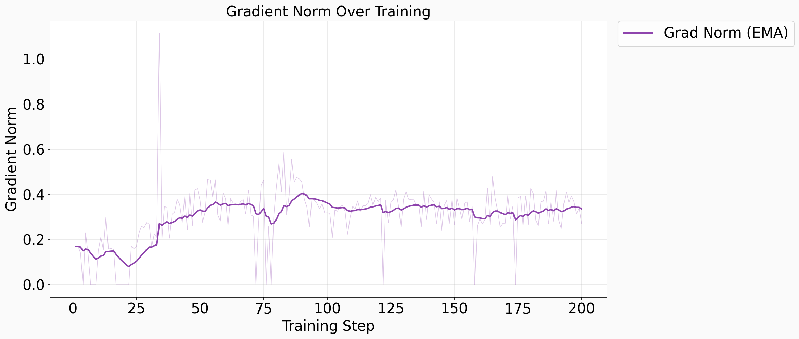

# WatchDog Evaluation Report

**Model:** Qwen/Qwen3-8B (bf16 + LoRA r=16)
**Training:** GRPO, 200 steps, 100 episodes (1641 samples after FLAG upsampling)
**Evaluation:** 300 samples from 30 held-out episodes
**Date:** March 8, 2026

---

## Summary Dashboard

---

## 1. Key Results

### Before vs After Training

| Metric    | Before Training | After Training | Change        |
|-----------|:--------------:|:--------------:|:-------------:|
| Accuracy  | 0.033          | **0.540**      | +0.507 (▲15.4×) |
| Precision | 0.333          | 0.215          | -0.118        |
| Recall    | 0.103          | **0.586**      | +0.483 (▲5.7×)  |
| F1        | 0.158          | **0.315**      | +0.157 (▲2.0×)  |

**Key takeaways:**
- **Accuracy improved 15.4x** — from near-random (3.3%) to 54.0%, showing the model learned to meaningfully distinguish clean and flagged turns.
- **Recall improved 5.7x** — from 10.3% to 58.6%. The trained model catches the majority of actual errors, whereas the base model missed nearly all of them.
- **F1 doubled** — from 0.158 to 0.315. While precision dropped (trade-off from increased flagging), the overall detection ability is substantially better.
- **Precision decreased** — the model now over-flags (62 false positives), indicating room for improvement in distinguishing subtle errors from normal behavior.

---

## 2. Action Distribution

### Before Training
| Action   | Count | Percentage |
|----------|------:|:----------:|
| PASS     | 8     | 2.7%       |
| FLAG     | 9     | 3.0%       |
| QUESTION | 130   | 43.3%      |
| UNKNOWN  | 153   | 51.0%      |

### After Training
| Action   | Count | Percentage |
|----------|------:|:----------:|
| PASS     | 154   | 51.3%      |
| FLAG     | 79    | 26.3%      |
| QUESTION | 5     | 1.7%       |
| UNKNOWN  | 62    | 20.7%      |

**Analysis:** Before training, the base Qwen3-8B model overwhelmingly produced QUESTION (43%) and UNKNOWN (51%) outputs — essentially refusing to make a decision. After GRPO training, the model decisively classifies: 51% PASS, 26% FLAG, with QUESTION dropping to near-zero (1.7%). UNKNOWN remains at 21%, suggesting some outputs still don't follow the expected format perfectly.

---

## 3. Confusion Matrix (Trained Model)

|                | Predicted FLAG | Predicted PASS |
|----------------|:--------------:|:--------------:|
| **Actual FLAG** | TP = 17        | FN = 12        |
| **Actual PASS** | FP = 62        | TN = 209       |

- **True Positives (17):** The model correctly identified 17 out of 29 actual errors (58.6% recall).
- **False Negatives (12):** 12 real errors were missed — these are the hardest cases for the model.
- **False Positives (62):** 62 clean turns were incorrectly flagged — the model is somewhat trigger-happy, causing the lower precision (21.5%).
- **True Negatives (209):** The model correctly passes 77.1% of clean turns.

---

## 4. Training Dynamics

### Reward Curve

The total reward starts deeply negative (~-3.0) and trends upward over 200 steps. The EMA-smoothed curve shows a clear trajectory from -3.0 to approximately 0.0, indicating the model transitioned from consistently wrong predictions to a mix of correct and incorrect ones.

### Reward Decomposition

- **Action Reward** (blue): Improved from ~-2.5 to ~0.0, showing the model learned to make better PASS/FLAG decisions.
- **Format Reward** (orange): Improved from ~-0.8 to ~-0.2, indicating the model learned the expected output format. The remaining -0.2 penalty likely corresponds to the 21% UNKNOWN outputs.

### Policy Entropy

Entropy initially drops (steps 1-30) as the model moves away from the random base policy, then recovers and stabilizes around 0.4-0.5. This is healthy — the model maintains exploration diversity while becoming more decisive.

### Learning Rate Schedule

A cosine schedule with warmup to 2×10⁻⁴ over the first ~30 steps, then decaying to near zero by step 200.

### Gradient Norm

Gradient norms start near zero (the model is barely updating from the base), rise to ~0.3-0.5 during active learning, and remain stable — no gradient explosion observed.

---

## 5. Training Configuration

| Parameter            | Value               |
|----------------------|---------------------|
| Base model           | Qwen/Qwen3-8B      |
| Quantization         | bf16                |
| LoRA rank            | 16                  |
| Training algorithm   | GRPO (TRL)          |
| Training steps       | 200                 |
| Max LR               | 2×10⁻⁴             |
| LR schedule          | Cosine with warmup  |
| Training episodes    | 100 (1641 samples)  |
| FLAG upsampling      | 98 → 739 (45% ratio)|
| Eval episodes        | 30 (300 samples)    |
| Max completion length| 384 tokens          |
| Training runtime     | ~80 minutes (4801s) |

---

## 6. Conclusions & Future Work

### What Worked
1. **GRPO with reward shaping** successfully taught the model to distinguish PASS from FLAG turns, moving from a non-functional base model to a usable detector.
2. **FLAG upsampling** to 45% was critical — without it, the model would have barely seen any positive examples.
3. **Format reward** as a separate component helped the model learn the structured output format alongside the classification task.

### Limitations
1. **Precision is low (21.5%)** — the model flags too many clean turns. In a real deployment, this would create alarm fatigue.
2. **UNKNOWN outputs (21%)** — a fifth of responses still don't produce valid actions, suggesting the format reward could be stronger.
3. **Only 200 training steps** — more training with curriculum difficulty scaling could further improve performance.

### Recommended Next Steps
- **Increase training steps** to 500-1000 with a lower learning rate for fine-grained improvement.
- **Adversarial training** (`train_adversarial.py`) — jointly train the mutator to generate harder errors while the detector improves.
- **Stricter format enforcement** — increase format reward penalty or add format-specific rejection sampling.
- **Threshold calibration** — tune the FLAG threshold to trade off precision vs recall for the deployment context.
